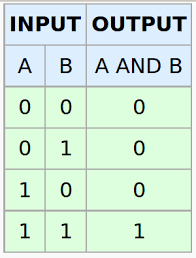
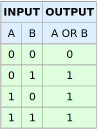
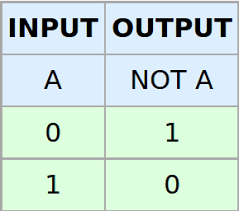

# Python unidad 2
Palabras reservadas de python
```
and	  exec  	not
as	 finally 	or
assert  	for	 pass
break	  from	 print
class	  global  	raise
continue  	if 	return
def	  import  	try
del	  in	 while
elif	 is	 with
else	 lambda	 yield
except
```

```
>>> import keyword
>>> keyword.kwlist
['False', 'None', 'True', 'and', 'as', 'assert', 'async', 'await', 'break', 'class', 'continue', 'def', 'del', 'elif', 'else', 'except', 'finally', 'for', 'from', 'global', 'if', 'import', 'in', 'is', 'lambda', 'nonlocal', 'not', 'or', 'pass', 'raise', 'return', 'try', 'while', 'with', 'yield']
>>>
```

### 1. Comentarios
En todos los lenguajes de programación existe la forma de poner comentarios al Código.
Los comentarios le sirven a los programadores para documentar ciertas partes del código sin que estos afecten la lógica del programa.

```
# Esto es un comentario de una sola línea
var1 = 15
""" este es un comentario
de varias líneas con triple comillas dobles"""
var1 = 15
var1 = 15 # Este comentario es de una línea también

```

### 2. Variables(En python todo es un objeto)
Una variable es un espacio de memoria de la computadora reservado para almacenar valores que cambian a lo largo del programa.

Mutable vs inmutable
Mutable: significa que el espacio en memoria del objeto puede modificarse.

Inmutable: Constantes. No existe la funcionalidad constante, sin embargo se simula.
Las tuplas son inmutables(Unidad 3)

PI=3.1416

### Convensión en los nombres de las Variables
1. Lower camel case
1. Upper camel case
1. Snake  case

Reglas básicas:
- Evitar nombres largos
- Evitar cosas como declarar x, y, t
- Usar Snake case para variables.
- No iniciar nombre de una vriable con números.
- Puede iniciar con '_'


```
[nombre_de_la_variable] = [valor_de_la_variable]
nombre="Pedro"
edad=20
var1=2.2
print(var1)
var1="Hola"
print(var1)
```
Como se puede observar las variables pueden ser redefinidas en el tipo de dato.
### 3. Tipos de datos
 1. Numéricos (int, float, long,conplex)
 2. String (cadenas, unicode y raw)
 3. Boolean (True, False)


#### *Numéricos*

  **int** 123
  **float** 15.12
  **complex** 3 + 12j


####  *String *

Sirven para almacenar cadenas de caracteres.

**str** 'manzana'
**unicode** u'äþþĺė'   # u de unicode 'u\00DD'
**str** r'C:\temp'  # r de raw, imprime la literal

```
nombre='Juan'
print(nombre)
saludo="hola amigo"
print(saludo)
print(saludo,nombre)
```
Python 3 acepta string de comilla simple (') para declarar una sola palabra, comillas dobles (") para representar una oración y triple comilla doble para representar una oración de múltiple línea.

```
color = 'azul'
descripcion="Auto semi compacto marca Honda"
comentarios=""" esto es un texto muy grande, por lo tanto
se tiene que escribir en multiples líneas
para ello se usa el triple
"""

print(color)
print(descripcion)
print(comentarios)

----
azul
Auto semi compacto marca Honda
 esto es un texto muy grande, por lo tanto
se tiene que escribir en multiples líneas
para ello se usa el triple

>>> descripcion
'Auto semi compacto marca Honda'
>>> comentarios
' esto es un texto muy grande, por lo tanto\nse tiene que escribir en multiples líneas\npara ello se usa el triple\n'
>>>
```

[Métodos del objetod String. file] (./Strings.md)

####  *Boolean*
Valores lógicos True (verdadero) y False(falso)
**bool** True - bool(1)
**bool** False - bool(0)

```
mayorEdad=True
print(mayorEdad)
mayorEdad=False
print(mayorEdad)


```
### type() e isinstance(var,tipo_datos)
```
print(type(mayorEdad))
print(type(nombre))

print(isinstance(mayorEdad, bool))
print(isinstance(True, int))
print(isinstance(nombre, int))
---
<class 'bool'>
<class 'str'>

True
True
False
```
#### *bases numéricas*
1. 0b or 0B **bin** binario (base 2).
1. 0o or 0O octal (base 8).
2. 0x or 0X Hexadecimal (base 16).

Ejemplo: De base a decimal.
```
print('Sólo hay ',0b10, 'tipos de peronas: ¡las que saben binario y las que no!')

print('Hexadecimal:',0xFF)

print('Octal:',0o17)
```

#### Decimal a base
```
hex(246)    # '0xf6'
bin(1234)   # '0b10011010010'
```

### Casting entre Tipos
casting significa conversion entre tipos. Solo se tiene que anteponer el tipo al que se quiere hacer la conversión.

Por ejemplo ```int('10')``` convierte la cadena 10 en valor numérico
```
entrada="12"
print(entrada)
edad=int(edad)
print(entrada)
```
### 4. Operadores Aritméticos

- \+ Suma
-	\- Resta
- \*	Multiplicación
- /	División
- **	Potenciación
- //	División, se obtiene parte entera del cociente
- %	División, se obtiene el resto

```

```


Se hereda la notación de C para realizar operaciones simplificadas:
```
c=10
c+=2 #Equivale a c = c + 2
print(c) #imprime 12
```
### Funciones numéricas

**pow()**
**abs()**
**round()**

```
pow(2,4)    #16
abs(-3) #3
abs(3)  #3

round(3)  #3.0
```
En el caso del redondeo es posible establecer la precisión.
``
pi=round(3.1415926535,4)
print(pi) #3.1416
``

#### Operadores  comparativos

- <	Menor que
- \>	Mayor que
- <=	Menor o igual que
- \>=	Mayor o igual que
- ==	Igual a
- \!=	Distinto de

```
3<4 # True
4<3 # False
```

#### Operadores lógicos

- and **Y lógico**

- or **o lógico**
 
- not ** negación lógica **


### 4.1 precedencia de Operadores
Operador	Descripción
(, )	Paréntesis
**	Potencia
*, /, %, //	Multiplicación, división, módulo y cociente
+, -	Adición y substracción
<=, <, >, >=	Operadores comparativos
==, !=	Operadores de igualdad
and, or, not	Operadores lógicos

```
a=10
b=4
c=0
c=a-b*3
print(c)# -3 ó 18???

```
Agrupando con Paréntesis
```
a=10
b=4
c=0
c=(a-b)*3
print(c)# -3 ó 18???

```
### 5. Estructuras de control de flujo

#### Condicionales.
**Indentacion**
Python usa la Indentación para establecer bloques de código que forman parte de una estructura de control.

Estructura if. Condicional simple
```
if <condición>:
  <sentencia 1>
  <sentencia 2>
```
ejemplo:
```
edad=18
if edad >= 18 :
    print('Es mayor de edad')
```

Estructura if-else, condicional con bifurcación.
```
if <condición>:
  <sentencia 1>
  <sentencia 2>
else:
  <sentencia 1 else>
  <sentencia 2 else>
```
Ejemplo:

```
edad=18

if edad >= 18 :
    print('Es mayor de edad')
else:
    print('Es menor de edad')
```

if-elif-else. Estructura if else anidado.

```
if <condición>:
  <sentencia 1>
  <sentencia 2>
elsif:
  <sentencia 1 else-if>
  <sentencia 2 else-if>
else:
  <sentencia 1 else>
  <sentencia 2 else>
```

Ejemplo:
```
x = int(input("Ingresa un numero: "))
Please enter an integer: 42
>>> if x < 0:
...     x = 0
...     print('Negativo, cambiado a 0')
... elif x == 0:
...     print('Cero')
... elif x == 1:
...     print('Uno')
... else:
...     print('Mayor que 1')
```
