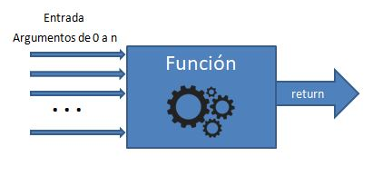

# Funciones
Una función es una unidad de código reutilizable, además de ser un mecanismo de organizar código.

Una función puede tomar de entrada cualquier cantidad de parámetros(de cualquier tipo) de entrada y retorna un sólo valor, de cualquier tipo de dato.



Puedes hacer dos cosas con una función:
1. Definirla.
2. Llamarla.

## Definición de una función en python 3:

#### Sintaxis

```
def <nombre_funcion>(<lista de argumentos>):
    <sentencia 1>
    <sentencia 2>
    ...
    <sentencia 3>
    return <algo>
```


Ejemplo: Definir una función que sume dos valores.

```
def sumar(a, b):
    c=a+b
    return c
```

## Llamado de una función

```
x=sumar(4,6)
print(f"4 + 6= {x}")
```

Otra versión de la misma función podría ser esta:

```
def sumar(a, b):
    print(f"{a} + {b}= {a+b}")
    return None
```

# Llamada
```
sumar(4,6)
```


## None y las funciones.
Es muy útil, tanto como argumento como para indicar que la función no regresa nada.


```
def multiplica(valor, veces):
    if valor == None:
        print(' Nada que imprimir')
    else:
        print(veces*valor)

multiplica('a',5)
multiplica(None,5)
multiplica(10,6)
```
## Argumentos poscicionales
Consideremos la siguiente función, que corresponde al registro de una comanda de platillos en un restaurante:

```
 menu_select(mesa,comensal ,entrada, medio, fuerte, postre):
    print(f"La selección del comensal {comensal} de la mesa {mesa}")
    print(f"Entrada: {entrada}")
    print(f"Segundo: {medio}")
    print(f"Fuerte:  {fuerte}")
    print(f"Postre:  {postre}")
    return None
```
La llamada adecuada sería esta:
```
menu_select(3,2,"Ensalada verde","crema de zanahoria","filete","Pastel de elote")
```
El resultado seria este:

```
La selección del comensal 2 de la mesa 3
Entrada: Ensalada verde
Segundo: crema de zanahoria
Fuerte:  filete
Postre:  Pastel de elote
```
La posición de los argumentos enviados a la llamada de la función importan. Como se puede observar en la siguiente llamada,  el orden de los argumentos cambian el resultado.

```
menu_select("crema de zanahoria","Ensalada verde","filete","Pastel de elote",3,2)
```
Resultado:

```
La selección del comensal Ensalada verde de la mesa crema de zanahoria
Entrada: filete
Segundo: Pastel de elote
Fuerte:  3
Postre:  2
```
Como se puede observar los valores son respetados según la posición que se envía el argumento.

Para resolver esto se usan los:

## Argumentos con palabra clave(keywords).
Los keywords de la función menu_select son:
- mesa
- comensal
- entrada
- medio
- postre

por lo cual podría enviarse los argumentos en el órden que se desee pero utilizando la keyword.


```
menu_select(medio="crema de zanahoria",entrada="Ensalada verde",fuerte="filete",postre="Pastel de elote",mesa=3,comensal=2)
```

## Argumentos por defecto (default)
Supongamos que si el comensal no pide un postre en específico, en ese caso se le ofrecerá una gelatina de limón.

```
menu_select(mesa,comensal ,entrada, medio, fuerte, postre="Gelatina de limón"):
   print(f"La selección del comensal {comensal} de la mesa {mesa}")
   print(f"Entrada: {entrada}")
   print(f"Segundo: {medio}")
   print(f"Fuerte:  {fuerte}")
   print(f"Postre:  {postre}")
   return None

menu_select(medio="Sopa azteca",entrada="Tequila",fuerte="Molcajete",mesa=4,comensal=3)

salida:
La selección del comensal 3 de la mesa 4
Entrada: Tequila
Segundo: Sopa azteca
Fuerte:  Molcajete
Postre:  Gelatina de limón
```
# Nota:
#### Los argumentos por defecto se evaluan en tiempo de programación, no en tiempo de ejecución.
Lo cuál significa que la variable por defecto se inicializa en la primer llamada a la función, las posteriores llemadas(dentro de la misma ejecución) no se inicializa.

ejemplo:
La siguiente función utiliza esta característica para agregar los impuestos a pagar en una lisa interna.

```
def registro_impuestos(impuesto_a_cobrar,lista_impuestos=[]):
    lista_impuestos.append(impuesto_a_cobrar)
    print(lista_impuestos)

registro_impuestos(16)  ## [16]
registro_impuestos(30)  ## ¿?
```
# Argumantos posicionales * tuplas

** El caracter '\*' ** sobre un parámetro de función significa que se obtendrá una **tupla** de argumentos posicionales.

Ejemplo:

```
def imprime_argumentos( *argumentos ):
    print("Estos son los argumentos recibidos:",argumentos)

imprime_argumentos()
imprime_argumentos(1,2,3)

# Algo mas completo:
imprime_argumentos("hola",10,12.1,True,("esto","es una", "tupla"), ["una","lista"],{'id':1,'desc':'un diccionario'})

resultado: ('hola', 10, 12.1, True, ('esto', 'es una', 'tupla'), ['una', 'lista'], {'id': 1, 'desc': 'un diccionario'})

```

La mejor forma de emplear esta característica de python es permitir a las funciones ser flexibles.
Por **ejemplo** en la clase *menu_select* de arriba, imagenemos la posibilidad de darle al comensal la posibilidad de indicar información adicional, como por ejemplo el término de su carne o los condimientos a los que es alérgico. La función sería así:


 ```
 print("Argumentos posicionales:")
 def menu_select2(mesa,comensal ,entrada, medio, fuerte,*adicionales):
    print(f"La selección del comensal {comensal} de la mesa {mesa}")
    print(f"Entrada: {entrada}")
    print(f"Segundo: {medio}")
    print(f"Fuerte:  {fuerte}")
    print(f"Instrucciones adicionales:{adicionales}")
    return None

 menu_select2(3,2,"Ensalada verde", "crema de zanahoria","filete", "Filete término medio","la ensalada sin ningun tipo de semilla","Adereso Ranch")

salida:
Argumentos posicionales:
La selección del comensal 2 de la mesa 3
Entrada: Ensalada verde
Segundo: crema de zanahoria
Fuerte:  filete
Instrucciones adicionales:('Filete término medio', 'la ensalada sin ningun tipo de semilla', 'Adereso Ranch')
 ```
 # Nota:
 ** Al hacerlos posicionales, ya no se podría cambiar el órden de los argumentos **

# Argumantos posicionales ** Diccionarios

Funciona de igual forma pero genera un diccionario. Para ejemplificar esto, se reescribirá la función menu_select.

```
print("Argumentos posicionales:")
def menu_select3(**comanda):
    print(f'Comanda:{comanda}')
    return None

menu_select3(mesa=3,comensal=2,entrada="Ensalada verde", medio="crema de z" +\
"anahoria",fuerte="filete",adicionales="Filete término medio, la ensalada sin" +\
"ningun tipo de semilla, Adereso Ranch")

Resultado:
Comanda:{'mesa': 3, 'comensal': 2, 'entrada': 'Ensalada verde', 'medio': 'crema de zanahoria', 'fuerte': 'filete', 'adicionales': 'Filete término medio, la ensalada sinningun tipo de semilla, Adereso Ranch'}
```

### Ejercicio: Modificar menu_select3 y dar formato a la salida:
Rresultado esperado:

```
Detalle:
                MESA:3
                COMENSAL:2
                ENTRADA:Ensalada verde
                MEDIO:crema de zanahoria
                FUERTE:filete
                ADICIONALES:Filete término medio, la ensalada sin ningun tipo de semilla, Adereso Ranch
```


# Funciones, Ciudadano de primera clase.
[En este link](https://developer.mozilla.org/en-US/docs/Glossary/First-class_Function)


# Funciones internas

Es posible definir funciones dentro de otra función, con el objetivo de modularizar tareas complejas dentro de una función.
Ejempo 1:

```
#### ejemplo 1

def funcion_externa(nombre):
    def funcion_interna(v):
        print(v[::-1])
    nombre=nombre.upper()
    funcion_interna(nombre)
funcion_externa('José José, El príncipe de la canción mexicana')

```

Ejemplo 2: Imagina que se requiere una función que calcule el costo total a cobrar a un cliente. La función debe calcular los costos en base a las siguientes reglas:
  1. Cada producto tiene un costo de $450.0
  2. Cuando se consumen de entre 3 y 5 productos el precio unitario es de $425.0
  3. Arriba de 5 piezas el producto cuesta: $400.0
  4. El IVA a cobrar es de 16%.
  5. Gastos de envío: $29.0 por pieza y $0 si el cliente va por ellos a la tienda.

```
### ejemplo 2
def calcular_venta(num_productos,envio_paqueteria):
    print('Iniciando venta')
    def calcular_descuentos(cantidad):
        total=0.0
        if cantidad > 0 and cantidad < 3:
            print('kllkjkljl')
            total =cantidad*450.0
        elif cantidad >= 3 and cantidad <=5:
            total=cantidad*425.0
        elif cantidad > 5:
            total=cantidad*400.0
        else:
            print("Error, valor no válido")
        print(total)
        return total
    def calcular_envio(cantidad,paqueteria):
        costos_envio=0.0
        if(paqueteria):
            costos_envio=cantidad*29.0
        return costos_envio

    return (calcular_descuentos(num_productos)+calcular_envio(num_productos,envio_paqueteria))*1.16

print(f"Total:{'%.3f'%calcular_venta(3,True)}")
```
