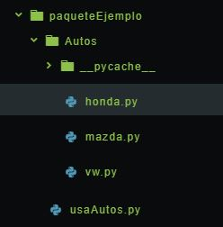

# Paquetes
En resumen un paquete es un directorio que ordena multiples modulos(archivos .py).

El objetivo es ordenar módulos en un solo lugar(el paquete), para programadores java un módulo python(.py) es equivalente a la definición de una clase java(.java), el paquete tienen el mismo objetivo en ambos lenguajes, organizar clases del mismo tipo en unidades manejables.

Por ejemplo, pensemos en un paquete que contiene 3 módulos que describen la información de marcas de automóbiles.

En la siguiente figura se observa la estructura y el código esta disponible en este repositorio.




El paquete esta definido en la carpeta autos y los módulos son *honda.py*, *vw.py* y *mazda.py*. De tal forma que se pueden importar desde otro programa python de la forma:

```
from Autos import mazda

print(mazda.get_marca()) # Mazda motors
```

#### Ejercicio:

Desarrollar un paquete que defina elementos de una computadora: Mouse, Teclado y CPU.

Hacer un programa que use este paquete y  use los módulos para ver en pantalla las características de una conputadora.
