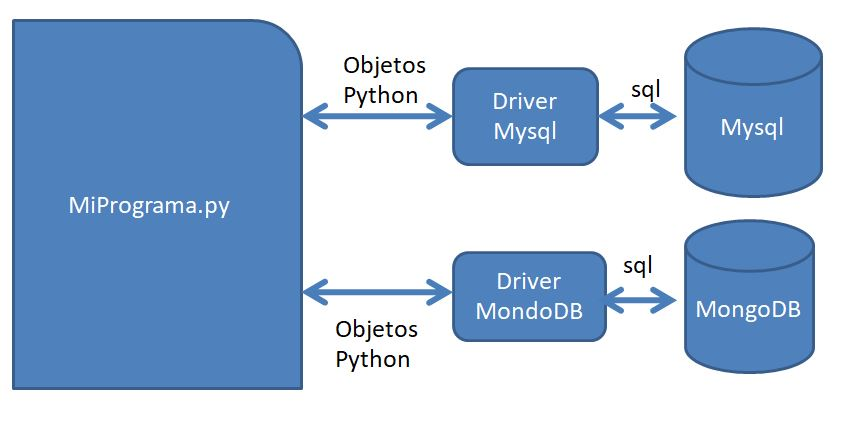

# Conexion a Bases de datos

Todos los lenguajes de programación tienen la capacidad de conectarse a Sistemas Administradores de Bases de datos (DBMS por sus siglas en inglés). Para ello requiere un driver (**connector**) que permitirá traducir instrucciones escritas en el lenguaje de programación a SQL y para actuar como un puente de ejecución.


<center>Arquitectura de conexión vía **connector**</center>

El primer paso es instalar el connector en nuestro sistema:
```
#pip install mysql-connector
```
Una vez instalado, lo podremos importar en nuestro programa y conectarnos con la función **connect**.
Esta función debe recibir los parametros de conexión en una lista python.

```
import mysql.connector

mi_connexion = mysql.connector.connect(
  host="localhost",
  user="root",
  passwd="yourpassword",
  database="mi_bd"
)

```


Una vez conectados podemos hacer manipulaciones SQL a la base de datos.

Para ello, hay que definir un objeto mas para enviar las consultas a MySql y  almacenar las respuestas del servidor de bases de datos.

```
import mysql.connector

mi_connexion = mysql.connector.connect(
  host="localhost",
  user="root",
  passwd="yourpassword",
  database="mi_bd"
)

cursor = mi_connexion.cursor()
```
Ahora si, listos para realizar manipulaciones.
# crear tablas

```
# mysql_conn.py
import mysql.connector
url='icofesa.car8v61lwyyb.us-west-2.rds.amazonaws.com'
usr='admin'
passwd='fakepassword'

mi_connexion = mysql.connector.connect(
  host=url,
  user=usr,
  passwd=passwd,
  database=db
)

cursor = mi_connexion.cursor()
sql="DROP TABLE IF EXISTS ejemplo1;" # Si ya existe, eliminarla
cursor.execute(sql)


sql='CREATE TABLE ejemplo1(id INT, user VARCHAR(50),mensaje VARCHAR(120));'
cursor.execute(sql)

```

# Sistema CRUD
Un sistema CRUD es un acrónimo de : **C**reate, **R**ead, **U**pdate y **D**elete. Lo cuál significa que es un sistema que realiza las operaciones basicas de manipulación de bases de datos.

A continuación realizaremos estas 4 operaciones básicas.

# Create (Insert)

```
# mysql_con0.py
mi_connexion = mysql.connector.connect(
  host=url,
  user=usr,
  passwd=passwd,
  database=db
)

cursor = mi_connexion.cursor()
sql="INSERT INTO CATEGORIAS VALUES(4,'Revistas');"
cursor.execute(sql)
mi_connexion.commit()
```

# READ (Select)
Para realizar un select el procedimiento inicial no cambia, lo que cambia es la sentencia SQL y como recuperar la tabla resultante.

La sentencia ```sql='SELECT * from ESTADOS;' ``` regresara el contenido de la tabla estados de la base de datos de trabajo.

Para recuperar dichos resultados, se hace uso de la funcion **fetchall()**. La cual regresa


```
# mysql_conn1.py
cursor = mi_connexion.cursor()
sql='SELECT * from ESTADOS;'
cursor.execute(sql)
result= cursor.fetchall()
print(result)
```


##### Ejercicio: Hacer una consula sobre la tabla: PRODUCTOS


#### Fetch One
Al ser un cursor, se puede iterar sobre el por medio de while y fetchone().

```
# mysql_conn2.py
cursor = mi_connexion.cursor()
sql='SELECT * from ESTADOS;'
cursor.execute(sql)
row = cursor.fetchone()
while row is not None:
  print(row)
  row = cursor.fetchone()
```

# Select con comodines

En la mayoria de los casos los valores de consulta vendran en variables, en estos casos se debe enviar los criterios de búsqueda en una tupla.

El query debe contruirse con los comodines **%s**

```
# mysql_conn3.py
cursor = mi_connexion.cursor()
sql='SELECT * from ESTADOS WHERE id_estado = %s ;'
id = ('15',) # Tupla
cursor.execute(sql,id)
row = cursor.fetchone()
print(row)

sql='SELECT * from CLIENTES WHERE razon_social LIKE %s  AND estado = %s;'
campos=('M%','3')
cursor.execute(sql,campos)
print(cursor.fetchall())

```
#### Ejercicio: hacer una consulta para la tabla PRODUCTOS cuyo categoria sea 3 y contenga una 'ES' en su campo nombre.

# Update
```
# mysql_conn3.py
cursor = mi_connexion.cursor()
sql="UPDATE TABLE CATEGORIAS SET nombre ='REVISTAS' WHERE id=4;"
cursor.execute(sql)
mi_connexion.commit()
print(f"{cursor.rowcount} registros afectados")
```

# Delete
```
# mysql_conn3.py
cursor = mi_connexion.cursor()
sql="DELETE FROM  CATEGORIAS  WHERE id=4;"
cursor.execute(sql)
mi_connexion.commit()
print(f"{cursor.rowcount} registros afectados")
```
