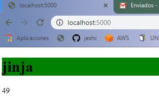

# render templating
Flask viene prediseñado con una máquina de render Jinja2 para páginas html.

para ello se importa el módulo que lo implementa:

```
from flask import Flask, render_template
```
### La carpeta templates.
Contiene los archivos html a enviar al cliente.

### {{ <expresión> }}
Cuando hablamos una máquina de render html, significa que las plantillas tienen secciones con datos incompletos, los datos son enviados a la pantilla con la función ```render_template()```

Por ejemplo, mandar la edad =44.

```
return render_template("index.html",edad=49)
```

Y del lado del template HTML se usan expresiones del modo ```{{ variable }} ```, la máquina render Jinja2 convierte la variable a información html y envía el resultado al cliente.

```
<body>
  <h1>  jinja </h1>
  <p>{{edad}}</p>

</body>
```

El resultado es el siguiente:




#### Ejercicio: Modificar el html para obtener un resultado parecido al siguiente:


### La carpeta static
Contiene los archivos estáticos necesarios para las páginas HTML cómo por ejemplo los archivos JS, CSS, imagenes, JSON, XML, etc.

#### Booststrap y materialize
Hacer ejemplos con estos dos frameworks CSS.
